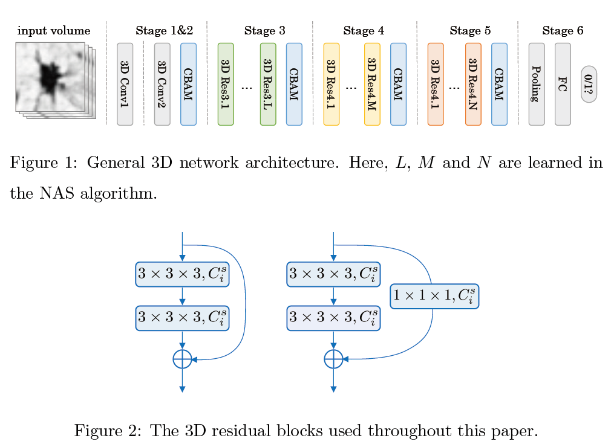

# NAS-Lung

> **3D Neural Architecture Search (NAS) for Pulmonary Nodules Classification**
>
> Hanliang Jiang, Fuhao Shen, Fei Gao\*, Weidong Han. *Learning Efficient, Explainable and Discriminative Representations for Pulmonary Nodules Classification*. Pattern Recognition, 113: 107825, 2021.
>
> ```latex
> @article{Jiang2021naslung,
> author = {Hanliang Jiang and Fuhao Shen and Fei Gao and Weidong Han},
> title = {Learning efficient, explainable and discriminative representations for pulmonary nodules classification},
> journal = {Pattern Recognition},
> volume = {113},
> pages = {107825},
> year = {2021},
> issn = {0031-3203},
> doi = {https://doi.org/10.1016/j.patcog.2021.107825},
> }
> ```
>
> [[Paper@PR]](https://www.sciencedirect.com/science/article/pii/S0031320321000121) [[Paper@arxiv]](https://arxiv.org/abs/2101.07429) [[Code@Github]](https://github.com/fei-hdu/NAS-Lung/issues/3)


## Architecture



## Results

### NASLung

| model               | Accu. | Sens. | Spec. | F1 Score | para.(M) |
| ------------------- | ----- | ----- | ----- | -------- | -------- |
| Multi-crop CNN      | 87.14 | -     | -     | -        | -        |
| Nodule-level 2D CNN | 87.30 | 88.50 | 86.00 | 87.23    | -        |
| Vanilla 3D CNN      | 87.40 | 89.40 | 85.20 | 87.25    | -        |
| DeepLung            | 90.44 | 81.42 | -     | -        | 141.57   |
| AE-DPN              | 90.24 | 92.04 | 88.94 | 90.45    | 678.69   |
|                     |       |       |       |          |          |
| **NASLung (ours)**  | 90.77 | 85.37 | 95.04 | 89.29    | 16.84    |

### Searched 3D Networks

| Model    | Accu. | Sens. | Spec. | F1 Score | para. |
| -------- | ----- | ----- | ----- | -------- | ----- |
| Model-1  | 88.83 | 87.20 | 90.12 | 87.50    | 0.14  |
| Model-2  | 88.42 | 84.38 | 91.46 | 86.67    | 2.61  |
| Model-3  | 88.17 | 84.44 | 91.60 | 86.50    | 3.90  |
| Model-4  | 88.13 | 83.20 | 92.28 | 86.30    | 2.54  |
| Model-5  | 87.97 | 83.72 | 91.31 | 86.22    | 0.43  |
| Model-6  | 87.77 | 83.67 | 91.00 | 86.03    | 0.22  |
| Model-7  | 87.76 | 84.14 | 89.79 | 85.98    | 0.86  |
| Model-8  | 88.00 | 82.43 | 92.69 | 85.97    | 4.02  |
| Model-9  | 88.04 | 78.01 | 96.09 | 85.36    | 4.06  |
| Model-10 | 87.22 | 82.70 | 90.92 | 85.32    | 0.24  |

## Prerequisites

- Linux or similar environment
- Python 3.7
- Pytorch 0.4.1
- NVIDIA GPU + CUDA CuDNN

## Getting Started

### Installation

- Clone this repo:

  ```shell script
  git clone https://github.com/fei-hdu/NAS-Lung
  cd NAS-Lung
  ```

- Install PyTorch 0.4+ and torchvision from [Pytorch](http://pytorch.org) and other dependencies (e.g., visdom and dominate). You can install all the dependencies by

  ```shell script
  pip install -r requirments.txt
  ```

- Download Dataset [LIDC-IDRI](https://wiki.cancerimagingarchive.net/display/Public/LIDC-IDRI)

### Neural Architecture Search

```shell script
python search_main.py --train_data_path {train_data_path}  --test_data_path {test_data_path} --save_module_path {save_module_path}
```

### Train/Test

- Train a model

  ```shell script
  sh run_training.sh
  ```

- Test a model

  ```shell script
  python test.py --test_data_path {test_data_path} --preprocess_path {preprocess_path} --model_path {model_path}
  ```

### DataSet

- [LIDC-IDRI](https://wiki.cancerimagingarchive.net/display/Public/LIDC-IDRI)

### Model Result

- our final result can be download:[Google Drive](https://drive.google.com/drive/folders/1vUFi5tEfMcDcKqMbxuN3Tt44QwLcDZnA?usp=sharing)

### Training/Test Tips

- Best practice for training and testing your models.
- Feel free to ask any questions about **_coding_**. **Fuhao Shen, `1048532267sfh@gmail.com`**

## Acknowledgement

- Our work/code is inspired by [Partial Order Pruning: for Best Speed/Accuracy Trade-off in Neural Architecture Search, CVPR 2019](https://github.com/lixincn2015/Partial-Order-Pruning).

## Selected References

- S. Armato III, G. et al., Data from **LIDC-IDRI**, The Cancer Imaging . [LIDC-IDRI](http://doi.org/10.7937/K9/TCIA.2015.LO9QL9SX).
- X. Li, Y. Zhou, Z. Pan, J. Feng, **Partial order pruning**: For best speed/accuracy trade-off in neural architecture search (2019) 9145–9153.
- S. Woo, J. Park, J.-Y. Lee, I. So Kweon, **CBAM**: Convolutional block attention module, in: Proceedings of the European Conference on Computer Vision (ECCV), 2018, pp. 3–19.
- W. Liu, Y. Wen, Z. Yu, M. Li, B. Raj, L. Song, **Sphereface**: Deep hypersphere embedding for face recognition, in: The IEEE Conference on Computer Vision and Pattern Recognition (CVPR), 2017.
- T. Elsken, J. H. Metzen, F. Hutter, **Neural architecture search**: A survey, Journal of Machine Learning Research 20 (55) (2019) 1–21.
- W. Zhu, C. Liu, W. Fan, X. Xie, **Deeplung**: Deep 3d dual path nets for automated pulmonary nodule detection and classification, in: 2018 IEEE Winter Conference on Applications of Computer Vision (WACV), IEEE, 2018, pp. 673–681.
